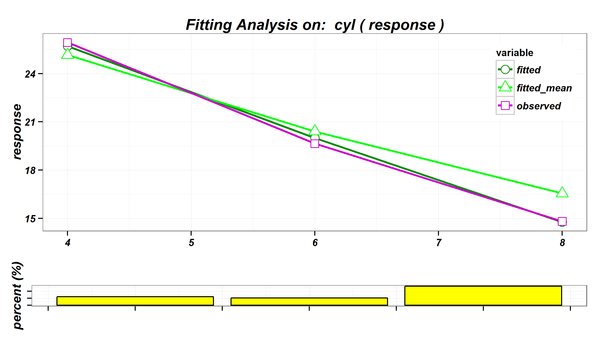

Introduction
========================================================
author: Sixiang Hu
date: 18th Jun, 2015

Wanted
========================================================
left: 70%
- Name      :   Sixiang Hu (Steven) 
- Gender    :   Male
- From      :   Wuhan, China (middle part of China)
- Major (UG):   Maths at Wuhan University 
- Major (PG):   Actuarial Science at Heroit-Watt University

***


Where is so called "middle part of China"?
========================================================

<!-- Map generated in R 3.2.0 by googleVis 0.5.8 package -->
<!-- Wed Jun 17 23:20:15 2015 -->


<!-- jsHeader -->
<script type="text/javascript">
 
// jsData 
function gvisDataMapID1f8c42b1c18 () {
var data = new google.visualization.DataTable();
var datajson =
[
 [
 30.65,
114.27,
"This is Wuhan in Hubei Province" 
] 
];
data.addColumn('number','Latitude');
data.addColumn('number','Longitude');
data.addColumn('string','Tip');
data.addRows(datajson);
return(data);
}
 
// jsDrawChart
function drawChartMapID1f8c42b1c18() {
var data = gvisDataMapID1f8c42b1c18();
var options = {};
options["showTip"] = true;
options["showLine"] = true;
options["enableScrollWheel"] = true;
options["mapType"] = "terrain";
options["width"] = "1000px";
options["height"] = "600px";
options["zoomLevel"] =      4;
options["useMapTypeControl"] = true;

    var chart = new google.visualization.Map(
    document.getElementById('MapID1f8c42b1c18')
    );
    chart.draw(data,options);
    

}
  
 
// jsDisplayChart
(function() {
var pkgs = window.__gvisPackages = window.__gvisPackages || [];
var callbacks = window.__gvisCallbacks = window.__gvisCallbacks || [];
var chartid = "map";
  
// Manually see if chartid is in pkgs (not all browsers support Array.indexOf)
var i, newPackage = true;
for (i = 0; newPackage && i < pkgs.length; i++) {
if (pkgs[i] === chartid)
newPackage = false;
}
if (newPackage)
  pkgs.push(chartid);
  
// Add the drawChart function to the global list of callbacks
callbacks.push(drawChartMapID1f8c42b1c18);
})();
function displayChartMapID1f8c42b1c18() {
  var pkgs = window.__gvisPackages = window.__gvisPackages || [];
  var callbacks = window.__gvisCallbacks = window.__gvisCallbacks || [];
  window.clearTimeout(window.__gvisLoad);
  // The timeout is set to 100 because otherwise the container div we are
  // targeting might not be part of the document yet
  window.__gvisLoad = setTimeout(function() {
  var pkgCount = pkgs.length;
  google.load("visualization", "1", { packages:pkgs, callback: function() {
  if (pkgCount != pkgs.length) {
  // Race condition where another setTimeout call snuck in after us; if
  // that call added a package, we must not shift its callback
  return;
}
while (callbacks.length > 0)
callbacks.shift()();
} });
}, 100);
}
 
// jsFooter
</script>
 
<!-- jsChart -->  
<script type="text/javascript" src="https://www.google.com/jsapi?callback=displayChartMapID1f8c42b1c18"></script>
 
<!-- divChart -->
  
<div id="MapID1f8c42b1c18" 
  style="width: 1000px; height: 600px;">
</div>

Hobbies
========================================================
left: 70%
- Classical Music (Piano)
- PC Games (Adventure, e.g. [Nancy Drew](https://en.wikipedia.org/wiki/Nancy_Drew))
- Travel (e.g. National trusts, Castels, Natural Views, etc.)
- Programming (C, C++, WPF, SAS,SQL, JavaScript, etc.)
- and, of cause, R!

***
  

Chartwell  
========================================================
<div align="center">

</div>

My R Package DataMan
========================================================

- What is it?
  This `R` package utilise `data.table` for a quick data summary and cleaning, and visualise models (`glm` and `gbm`) in an `Emblem` way.
- Where is it? 
  ```
  https://github.com/SixiangHu/DataMan
  ```
- what is it looks like?

My R Package DataMan - `DataSummary`
========================================================

```r
DataSummary(cars)
```

```
      VarName VarType Unique Missing Mean.Mode Min Max
speed   speed numeric     19       0      15.4   4  25
dist     dist numeric     35       0     42.98   2 120
```

My R Package DataMan - `modelPlot`
========================================================

```r
glm1 <- glm(formula = mpg ~ cyl + hp, family = Gamma(log), data = mtcars, weights = wt)
modelPlot(glm1,"cyl",modelType="glm",interactive=FALSE)
```

 

Other interesting R things 
========================================================
- Reproduceble Report (RMarkDown / R Presentation)
- Interactive Map (`leafletR` package)
- Shiny Apps (Using `shiny` package for data mining)
- Data visualisation
