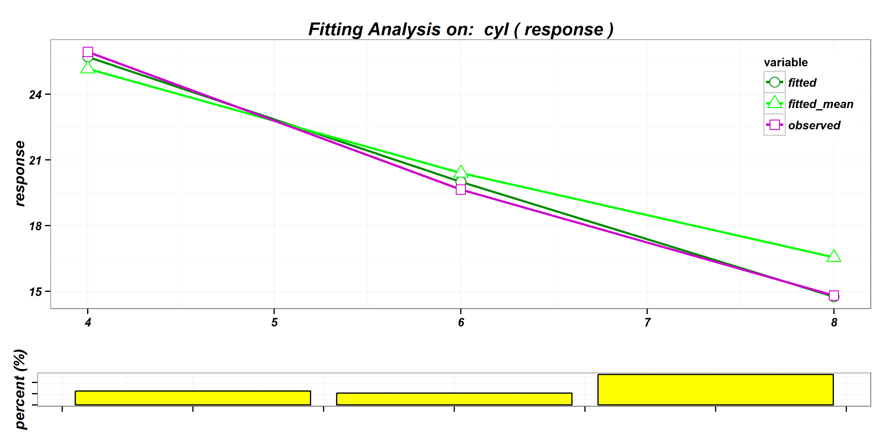

Introduction
========================================================
author: Sixiang Hu
date: 18th Jun, 2015

Wanted
========================================================
left: 70%
- Name      :   Sixiang Hu (Steven) 
- Gender    :   Male
- From      :   Wuhan, China (middle part of China)
- Major (UG):   Maths at Wuhan University 
- Major (PG):   Actuarial Science at Heroit-Watt University

***


Where is so called "middle part of China"?
========================================================

<!-- Map generated in R 3.2.0 by googleVis 0.5.8 package -->
<!-- Thu Jun 18 00:23:06 2015 -->


<!-- jsHeader -->
<script type="text/javascript">
 
// jsData 
function gvisDataMapID270c5ac75c8b () {
var data = new google.visualization.DataTable();
var datajson =
[
 [
 30.65,
114.27,
"This is Wuhan in Hubei Province" 
] 
];
data.addColumn('number','Latitude');
data.addColumn('number','Longitude');
data.addColumn('string','Tip');
data.addRows(datajson);
return(data);
}
 
// jsDrawChart
function drawChartMapID270c5ac75c8b() {
var data = gvisDataMapID270c5ac75c8b();
var options = {};
options["showTip"] = true;
options["showLine"] = true;
options["enableScrollWheel"] = true;
options["mapType"] = "terrain";
options["width"] = "1000px";
options["height"] = "600px";
options["zoomLevel"] =      4;
options["useMapTypeControl"] = true;

    var chart = new google.visualization.Map(
    document.getElementById('MapID270c5ac75c8b')
    );
    chart.draw(data,options);
    

}
  
 
// jsDisplayChart
(function() {
var pkgs = window.__gvisPackages = window.__gvisPackages || [];
var callbacks = window.__gvisCallbacks = window.__gvisCallbacks || [];
var chartid = "map";
  
// Manually see if chartid is in pkgs (not all browsers support Array.indexOf)
var i, newPackage = true;
for (i = 0; newPackage && i < pkgs.length; i++) {
if (pkgs[i] === chartid)
newPackage = false;
}
if (newPackage)
  pkgs.push(chartid);
  
// Add the drawChart function to the global list of callbacks
callbacks.push(drawChartMapID270c5ac75c8b);
})();
function displayChartMapID270c5ac75c8b() {
  var pkgs = window.__gvisPackages = window.__gvisPackages || [];
  var callbacks = window.__gvisCallbacks = window.__gvisCallbacks || [];
  window.clearTimeout(window.__gvisLoad);
  // The timeout is set to 100 because otherwise the container div we are
  // targeting might not be part of the document yet
  window.__gvisLoad = setTimeout(function() {
  var pkgCount = pkgs.length;
  google.load("visualization", "1", { packages:pkgs, callback: function() {
  if (pkgCount != pkgs.length) {
  // Race condition where another setTimeout call snuck in after us; if
  // that call added a package, we must not shift its callback
  return;
}
while (callbacks.length > 0)
callbacks.shift()();
} });
}, 100);
}
 
// jsFooter
</script>
 
<!-- jsChart -->  
<script type="text/javascript" src="https://www.google.com/jsapi?callback=displayChartMapID270c5ac75c8b"></script>
 
<!-- divChart -->
  
<div id="MapID270c5ac75c8b" 
  style="width: 1000px; height: 600px;">
</div>

Hobbies
========================================================
left: 70%
- Classical Music (Piano)
- PC Games (Adventure, e.g. [Nancy Drew](https://en.wikipedia.org/wiki/Nancy_Drew))
- Travel (e.g. National trusts, Castels, Natural Views, etc.)
- Programming (C, C++, WPF, SAS,SQL, JavaScript, etc.)
- and, of cause, R!

***
  

Chartwell  
========================================================
<div align="center">

</div>

My R Package DataMan
========================================================

- What is it?
  This `R` package utilise `data.table` for a quick data summary and cleaning, and visualise models (`glm` and `gbm`) in an `Emblem` way.
- Where is it? 
  ```
  https://github.com/SixiangHu/DataMan
  ```
- what is it looks like?

My R Package DataMan - `DataSummary`
========================================================

```r
DataSummary(cars)
```

```
      VarName VarType Unique Missing Mean.Mode Min Max
speed   speed numeric     19       0      15.4   4  25
dist     dist numeric     35       0     42.98   2 120
```

My R Package DataMan - `modelPlot`
========================================================

```r
glm1 <- glm(formula = mpg ~ cyl + hp, family = Gamma(log), data = mtcars, weights = wt)

modelPlot(glm1,"cyl",modelType="glm",interactive=FALSE)
```

 

My R Package DataMan - `sankeyPlot`
========================================================

```r
fit <- rpart(Kyphosis ~ Age + Number + Start, data = kyphosis)
myplot <- sankeyPlot(fit)
myplot$print('myplot1', include_assets = TRUE, cdn = TRUE)
```

<link rel='stylesheet' href=http://timelyportfolio.github.io/rCharts_d3_sankey/css/sankey.css>
<script type='text/javascript' src=http://d3js.org/d3.v3.min.js></script>
<script type='text/javascript' src=http://timelyportfolio.github.io/rCharts_d3_sankey/js/sankey.js></script> 
 <style>
  .rChart {
    display: block;
    margin-left: auto; 
    margin-right: auto;
    width: 750px;
    height: 750px;
  }  
  </style>
<div id = 'myplot1' class = 'rChart d3_sankey'></div>
锘戼<U+3E66><!--Attribution:
Mike Bostock https://github.com/d3/d3-plugins/tree/master/sankey
Mike Bostock http://bost.ocks.org/mike/sankey/
-->

<script>
(function(){
var params = {
 "dom": "myplot1",
"width":    750,
"height":    750,
"data": {
 "source": [ "Start (64/17)", "Start (64/17)", "Start (56/6)", "Start (56/6)", "Age (27/6)", "Age (27/6)", "Age (15/6)", "Age (15/6)" ],
"target": [ "Start (56/6)", "<leaf> (8/11)", "<leaf> (29/0)", "Age (27/6)", "<leaf> (12/0)", "Age (15/6)", "<leaf> (12/2)", "<leaf> (3/4)" ],
"value": [ 0.76543, 0.23457, 0.35802, 0.40741, 0.14815, 0.25926, 0.17284, 0.08642 ] 
},
"nodeWidth":     15,
"nodePadding":     10,
"layout":     32,
"units": "",
"id": "myplot1" 
};

params.units ? units = " " + params.units : units = "";

//hard code these now but eventually make available
var formatNumber = d3.format("0,.0f"),    // zero decimal places
    format = function(d) { return formatNumber(d) + units; },
    color = d3.scale.category20();

if(params.labelFormat){
  formatNumber = d3.format(".2%");
}

var svg = d3.select('#' + params.id).append("svg")
    .attr("width", params.width)
    .attr("height", params.height);
    
var sankey = d3.sankey()
    .nodeWidth(params.nodeWidth)
    .nodePadding(params.nodePadding)
    .layout(params.layout)
    .size([params.width,params.height]);
    
var path = sankey.link();
    
var data = params.data,
    links = [],
    nodes = [];
    
//get all source and target into nodes
//will reduce to unique in the next step
//also get links in object form
data.source.forEach(function (d, i) {
    nodes.push({ "name": data.source[i] });
    nodes.push({ "name": data.target[i] });
    links.push({ "source": data.source[i], "target": data.target[i], "value": +data.value[i] });
}); 

//now get nodes based on links data
//thanks Mike Bostock https://groups.google.com/d/msg/d3-js/pl297cFtIQk/Eso4q_eBu1IJ
//this handy little function returns only the distinct / unique nodes
nodes = d3.keys(d3.nest()
                .key(function (d) { return d.name; })
                .map(nodes));

//it appears d3 with force layout wants a numeric source and target
//so loop through each link replacing the text with its index from node
links.forEach(function (d, i) {
    links[i].source = nodes.indexOf(links[i].source);
    links[i].target = nodes.indexOf(links[i].target);
});

//now loop through each nodes to make nodes an array of objects rather than an array of strings
nodes.forEach(function (d, i) {
    nodes[i] = { "name": d };
});

sankey
  .nodes(nodes)
  .links(links)
  .layout(params.layout);
  
var link = svg.append("g").selectAll(".link")
  .data(links)
.enter().append("path")
  .attr("class", "link")
  .attr("d", path)
  .style("stroke-width", function (d) { return Math.max(1, d.dy); })
  .sort(function (a, b) { return b.dy - a.dy; });

link.append("title")
  .text(function (d) { return d.source.name + " 鈫<U+393C><U+3E32> " + d.target.name + "\n" + format(d.value); });

var node = svg.append("g").selectAll(".node")
  .data(nodes)
.enter().append("g")
  .attr("class", "node")
  .attr("transform", function (d) { return "translate(" + d.x + "," + d.y + ")"; })
.call(d3.behavior.drag()
  .origin(function (d) { return d; })
  .on("dragstart", function () { this.parentNode.appendChild(this); })
  .on("drag", dragmove));

node.append("rect")
  .attr("height", function (d) { return d.dy; })
  .attr("width", sankey.nodeWidth())
  .style("fill", function (d) { return d.color = color(d.name.replace(/ .*/, "")); })
  .style("stroke", function (d) { return d3.rgb(d.color).darker(2); })
.append("title")
  .text(function (d) { return d.name + "\n" + format(d.value); });

node.append("text")
  .attr("x", -6)
  .attr("y", function (d) { return d.dy / 2; })
  .attr("dy", ".35em")
  .attr("text-anchor", "end")
  .attr("transform", null)
  .text(function (d) { return d.name; })
.filter(function (d) { return d.x < params.width / 2; })
  .attr("x", 6 + sankey.nodeWidth())
  .attr("text-anchor", "start");

// the function for moving the nodes
  function dragmove(d) {
    d3.select(this).attr("transform", 
        "translate(" + (
                   d.x = Math.max(0, Math.min(params.width - d.dx, d3.event.x))
                ) + "," + (
                   d.y = Math.max(0, Math.min(params.height - d.dy, d3.event.y))
                ) + ")");
        sankey.relayout();
        link.attr("d", path);
  }
})();
</script>

Other interesting R things 
========================================================
- Reproduceble Report (RMarkDown / R Presentation)
- Interactive Map (`leafletR` package)
- Shiny Apps (Using `shiny` package for data mining)
- Data visualisation
